# Deployment Guide

### Obtaining Weather API Key

1. Visit https://www.weatherapi.com/
2. Click "Sign Up" or "Get API Key"
3. Create a free account
4. After login, go to your dashboard
5. Copy your API key
6. Add the key to `weather-secrets.env`:
   ```
   WEATHER_API_KEY=your_api_key_here
   ```

## Step 1: Create Namespace

```bash
kubectl apply -f base/namespace.yaml
```

Verify:

```bash
kubectl get namespace weather
```

## Step 2: Create Secrets

First, ensure you have filled in all .env files with actual values:

- `postgres-secrets.env`
- `weather-secrets.env`
- `backup-aws-secrets.env`
- `discord-secrets.env`

Create secrets:

```bash
kubectl create secret generic postgres-secrets \
  --from-env-file=postgres-secrets.env \
  -n weather

kubectl create secret generic weather-app-secrets \
  --from-env-file=weather-secrets.env \
  -n weather

kubectl create secret generic backup-aws-secrets \
  --from-env-file=backup-aws-secrets.env \
  -n weather

kubectl create secret generic discord-secrets \
  --from-env-file=discord-secrets.env \
  -n weather
```

Verify:

```bash
kubectl get secrets -n weather
```

## Step 3: Apply ConfigMaps

```bash
kubectl apply -f base/configmaps/postgres-config.yaml

kubectl apply -f base/configmaps/weather-app-config.yaml

kubectl apply -f base/configmaps/backup-config.yaml
```

Verify:

```bash
kubectl get configmaps -n weather
```

## Step 4: Apply RBAC

```bash
kubectl apply -f base/rbac/serviceaccounts.yaml

kubectl apply -f base/rbac/roles.yaml
```

Verify:

```bash
kubectl get serviceaccounts -n weather

kubectl get roles -n weather

kubectl get rolebindings -n weather
```

## Step 5: Deploy PostgreSQL

```bash
kubectl apply -f base/postgres/service.yaml

kubectl apply -f base/postgres/statefulset.yaml
```

Wait for PostgreSQL to be ready:

```bash
kubectl get pods -n weather -w
```

Verify:

```bash
kubectl get statefulset -n weather

kubectl get pvc -n weather

kubectl logs statefulset/postgres -n weather
```

## Step 6: Deploy Application

```bash
kubectl apply -f base/app/service.yaml

kubectl apply -f base/app/deployment.yaml
```

Wait for app to be ready:

```bash
kubectl get pods -n weather -w
```

Verify:

```bash
kubectl get deployment -n weather

kubectl get pods -n weather

kubectl logs deployment/weather-app -n weather
```

## Step 7: Deploy CronJobs

Note: CronJobs require postgres-config and backup-config ConfigMap to be applied first (already done in Step 3).

```bash
kubectl apply -f base/jobs/cronjob-weather.yaml

kubectl apply -f base/jobs/cronjob-backup.yaml
```

Verify:

```bash
kubectl get cronjobs -n weather
```

## Architecture Diagram

1.Overall Architecture Diagram


2.Security Architecture


3.Backup Architecture


4.Restore Architecture

